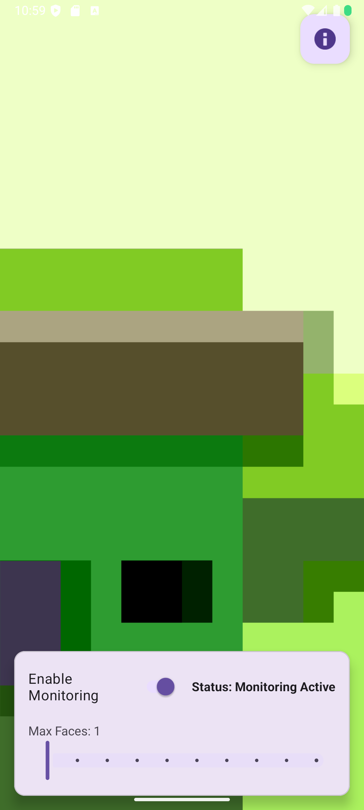

# PeekGuard for Android

PeekGuard is an Android application that acts as a privacy shield for your screen. It uses your device's front-facing camera to ensure you're the only one looking at your phone. If an extra face is detected, it discreetly alerts you, helping to prevent "shoulder surfing" in public spaces.

The core principle of PeekGuard is **privacy first**. All face detection and image processing happen entirely on your device. No data is ever stored, analyzed remotely, or transmitted off your phone.

 

 -->

## ✨ Key Features

*   **Real-time Face Detection:** Uses the camera to count people looking at the screen in real-time.
*   **Customizable Alerts:** Set the maximum number of faces (from 1 to many) allowed before a privacy alert is triggered.
*   **Background Monitoring:** A persistent foreground service keeps monitoring active even when the app is in the background.
*   **Visual Feedback:** Draws bounding boxes around detected faces directly on the in-app camera preview.
*   **On-Device Processing:** All processing is done locally and securely on your device. Your camera feed never leaves your phone.
*   **System Overlay Alerts:** Displays alerts on top of other applications for immediate notification.
*   **Modern UI:** A simple, clean interface built with Material Design components, including support for a dark theme.

## ⚙️ How It Works

PeekGuard leverages modern Android libraries to deliver a robust and private experience:

1.  **CameraX:** Provides a stable and easy-to-use API to access the camera feed.
2.  **Google's ML Kit (Face Detection):** This on-device machine learning library processes the camera feed to find and count faces. It's fast, efficient, and works offline.
3.  **Foreground Service:** The monitoring runs as a foreground service, which allows it to stay active in the background and display a persistent notification, keeping the user aware that it's running.
4.  **System Overlays:** When an alert is needed, the app uses the "Display over other apps" permission to show a non-intrusive warning.

## 🛠️ Tech Stack & Dependencies

This project is built with Kotlin and leverages a suite of modern Android libraries:

*   **[CameraX](https://developer.android.com/training/camerax) (`1.5.2`):** For a robust and lifecycle-aware camera implementation (`camera-camera2`, `camera-lifecycle`, `camera-view`).
*   **[Google ML Kit](https://developers.google.com/ml-kit) (`16.1.7`):** For fast, on-device face detection (`face-detection`).
*   **[Material Components for Android](https://material.io/develop/android) (`1.13.0`):** For modern UI components like sliders, switches, and dialogs.
*   **[AndroidX Lifecycle](https://developer.android.com/jetpack/androidx/releases/lifecycle) (`2.8.7`):** To manage background services and UI lifecycles (`lifecycle-service`, `lifecycle-process`).
*   **[AndroidX Activity](https://developer.android.com/jetpack/androidx/releases/activity) (`1.12.2`):** For handling activity results and permissions.
*   **[AndroidX AppCompat](https://developer.android.com/jetpack/androidx/releases/appcompat) (`1.7.1`):** For base app compatibility.

## 🚀 How to Build

This is a standard Android Studio project.

1.  Clone this repository.
2.  Open the project in the latest version of Android Studio.
3.  Let Gradle sync the dependencies.
4.  Build and run the application on an emulator or a physical device.

## 🤝 Contributing

Contributions are welcome! If you have a feature request, bug report, or want to contribute to the code, please feel free to open an issue or submit a pull request.

## 📄 License

This project is licensed under the MIT License. See the [LICENSE](LICENSE) file for details.

'''
MIT License

Copyright (c) 2024 Your Name

Permission is hereby granted, free of charge, to any person obtaining a copy
of this software and associated documentation files (the "Software"), to deal
in the Software without restriction, including without limitation the rights
to use, copy, modify, merge, publish, distribute, sublicense, and/or sell
copies of the Software, and to permit persons to whom the Software is
furnished to do so, subject to the following conditions:

The above copyright notice and this permission notice shall be included in all
copies or substantial portions of the Software.

THE SOFTWARE IS PROVIDED "AS IS", WITHOUT WARRANTY OF ANY KIND, EXPRESS OR
IMPLIED, INCLUDING BUT NOT LIMITED TO THE WARRANTIES OF MERCHANTABILITY,
FITNESS FOR A PARTICULAR PURPOSE AND NONINFRINGEMENT. IN NO EVENT SHALL THE
AUTHORS OR COPYRIGHT HOLDERS BE LIABLE FOR ANY CLAIM, DAMAGES OR OTHER
LIABILITY, WHETHER IN AN ACTION OF CONTRACT, TORT OR OTHERWISE, ARISING FROM,
OUT OF OR IN CONNECTION WITH THE SOFTWARE OR THE USE OR OTHER DEALINGS IN THE
SOFTWARE.
'''
